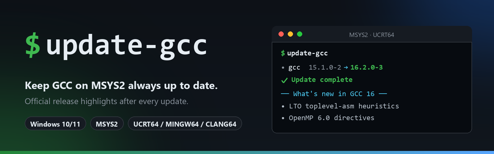

# msys2-gcc-setup

<div align="center">
  
</div>

<div align="center">

[](https://github.com/laurentvv/msys2-gcc-setup/releases/latest)
[](LICENSE)


</div>

**The only tool that updates GCC on Windows *and* tells you what changed.**

`pacman -Syu` upgrades your compiler silently. Nobody reads the release notes
afterwards — until a build breaks on a removed flag, a new warning, or a
changed language default. **msys2-gcc-setup** closes that gap: it keeps GCC on
MSYS2 at the latest version and, at every update, shows you a readable digest
of the official release notes from [gcc.gnu.org](https://gcc.gnu.org) — new
language features, optimizations, breaking changes — with links to the porting
guide. It also installs by a single zip extraction and makes the compiler
callable from any terminal.

Honestly: set it up once, then it's just *run one command, read the highlights,
get back to coding.*

### Why not just `pacman -Syu`?

| | plain pacman | msys2-gcc-setup |
|---|---|---|
| Updates the compiler | ✅ | ✅ |
| Shows you what's new after the update | ❌ | ✅ official highlights digest |
| Handles UCRT64 / MINGW64 / CLANG64 variants | manual package names | automatic detection |
| Keeps a readable history (versions + highlights) | ❌ | ✅ `/var/log/gcc-updates.log` |
| One-zip-extraction install + reversible PATH helper | ❌ | ✅ |

## ✨ Features

- **One-double-click setup** — `add-to-path` makes `gcc`, `pacman` and `bash` callable from any terminal (CMD, PowerShell, VS Code...), reversibly, without shadowing Windows built-ins.
- **Always up to date** — compares your installed GCC against the MSYS2 repositories (`pacman -Sy` + `vercmp`) and upgrades only when a newer version exists.
- **Always shows the news** — fetches the official *changes* page for the target major version and converts it into a readable summary (caveats, general improvements, C/C++ changes, OpenMP, …).
- **Multi-environment aware** — detects every GCC variant you have installed: UCRT64, MINGW64, CLANG64 and the MSYS subsystem.
- **Compiler-only by default** — upgrades the toolchain without touching the rest of your system. Use `--full` if you want a complete `pacman -Syu`.
- **Update history** — every run (versions old → new, plus the highlights) is appended to `/var/log/gcc-updates.log`.
- **Automation-friendly** — non-interactive and quiet modes, ready for the Windows Task Scheduler.
- **Zero dependency** — just MSYS2 with its bundled tools (`pacman`, `curl`, `sed`, `awk`). Nothing to install.

## 📋 Requirements

| Requirement | Notes |
|---|---|
| Windows 10 or 11 | Test scripts are designed for MSYS2 on Windows |
| [MSYS2](https://www.msys2.org) | Default install location is `C:\msys64` |
| GCC installed via pacman | e.g. `pacman -S mingw-w64-ucrt-x86_64-gcc` |
| Internet access | Only needed to sync repositories and fetch release notes |

## 🚀 Installation

### Option A — from the release (recommended)

Releases are named after the **GCC version** they ship with (e.g. `gcc-16.2.0`).
The zip mirrors the MSYS2 root, so installing is a **single extraction** into
`C:\msys64` (adjust if MSYS2 lives elsewhere):

1. Extract the **contents** of [`msys2-gcc-setup.zip`](https://github.com/laurentvv/msys2-gcc-setup/releases/latest/download/msys2-gcc-setup.zip) into `C:\msys64`. You end up with `C:\msys64\usr\local\bin\update-gcc` and the helper scripts at `C:\msys64\`.
2. Optional: double-click `add-to-path.cmd` to call `gcc` from any terminal (see below).
3. Open an MSYS2 shell (for example the **UCRT64** shortcut) and run `update-gcc`.

Or in one go from **PowerShell**:

```powershell
$msys = "C:\msys64"   # adjust if MSYS2 lives elsewhere
Invoke-WebRequest "https://github.com/laurentvv/msys2-gcc-setup/releases/latest/download/msys2-gcc-setup.zip" -OutFile "$env:TEMP\msys2-gcc-setup.zip"
Expand-Archive "$env:TEMP\msys2-gcc-setup.zip" -DestinationPath $msys -Force
```

> The asset keeps its stable name `msys2-gcc-setup.zip`, so the
> `releases/latest/download/...` URL always serves the newest package even
> though release names follow the GCC version.

### Option B — from source

```powershell
git clone https://github.com/laurentvv/msys2-gcc-setup.git
cd msys2-gcc-setup
copy update-gcc     C:\msys64\usr\local\bin\
copy update-gcc.cmd C:\msys64\
```

### Option C — optional: make `gcc` available from any terminal

MSYS2 compilers normally live inside the MSYS2 shells. To also call `gcc`,
`pacman` or `bash` from CMD, PowerShell or VS Code, add MSYS2 to your
Windows PATH:

```powershell
powershell -ExecutionPolicy Bypass -File add-to-path.ps1
```

or simply double-click `add-to-path.cmd` — both ship in the release zip and end
up at the MSYS2 root after installation. The script:

- adds `<MSYS2 root>`, `usr\bin` and every **actually installed** toolchain (`ucrt64\bin`, `mingw64\bin`, `clang64\bin`) — empty environment stubs are skipped;
- **appends** entries at the end of PATH, so Windows built-in tools (`find`, `sort`, `tar`…) always keep priority;
- is **idempotent** — safe to run again, it skips what is already there;
- touches your user PATH only (`-Scope Machine` targets all users, from an elevated PowerShell), and preserves the original registry value kind (`REG_EXPAND_SZ`), so `%VAR%`-style entries keep working;
- broadcasts the settings change, so terminals opened afterwards see it right away — no reboot, no logout.

To undo at any time:

```powershell
powershell -ExecutionPolicy Bypass -File remove-from-path.ps1
```

## 🖥️ Usage

Run it **inside an MSYS2 shell** (not Git Bash, not CMD):

```
$ update-gcc
=== Mise à jour du compilateur GCC — 09/09/2026 17:34 ===
• Synchronisation des dépôts MSYS2…
• mingw-w64-ucrt-x86_64-gcc : déjà à jour (16.2.0-3).
✔ Le compilateur est déjà à la dernière version disponible.
```

> 🇫🇷 **Note:** the console messages are in French (the author's language) — the
> behaviour and the options below are exactly what they say in English.

When a new version is available, the update is applied and the release highlights
are printed, for example:

```
• mingw-w64-ucrt-x86_64-gcc : mise à jour disponible 15.1.0-2 → 16.2.0-3
✔ Mise à jour terminée.
────────── Nouveautés GCC 16 ──────────
# GCC 16 Release Series Changes, New Features, and Fixes
## Caveats
• The so-called "json" format for -fdiagnostics-format= has been removed…
## General Improvements
• Link-Time Optimization now supports better handling of toplevel asm…
...
Liens utiles pour GCC 16 :
  • Tous les changements : https://gcc.gnu.org/gcc-16/changes.html
  • Guide de migration  : https://gcc.gnu.org/gcc-16/porting_to.html
  • Support du C++      : https://gcc.gnu.org/gcc-16/cxx-status.html
```

### Options

| Command | Effect |
|---|---|
| `update-gcc` | Check, update GCC if needed, then show the release highlights |
| `update-gcc --check` | Check only — installs nothing, still shows what's coming |
| `update-gcc --news` | Show the release highlights of the currently installed version |
| `update-gcc --yes` / `-y` | Non-interactive: don't ask for confirmation (for schedulers) |
| `update-gcc --full` | Upgrade the **whole system** (`pacman -Syu`) instead of GCC only |
| `update-gcc --quiet` / `-q` | Silent unless an update is actually applied |
| `update-gcc --help` | Show the built-in help |

## ⏰ Automate it (Task Scheduler)

To keep GCC always fresh without thinking about it, schedule a weekly run:

```bat
schtasks /Create /TN "Update GCC" /SC WEEKLY /D MON /ST 07:00 /TR "C:\msys64\update-gcc.cmd --yes --quiet"
```

The full history — every version bump and the corresponding highlights — stays
available in the log file, so a silent scheduled run is never a missed changelog.

## ⚙️ How it works

1. **Detect** every installed GCC package (`mingw-w64-*-gcc`, `gcc`) with `pacman -Q`.
2. **Sync** the repositories (`pacman -Sy`) and compare versions with pacman's own `vercmp`.
3. **Update** the compiler with `pacman -S` (or `pacman -Syu` with `--full`).
4. **Show the news**: download `https://gcc.gnu.org/gcc-<major>/changes.html` for each new major version and reformat it (headings, bullet points, links to the porting guide and C++ status page).
5. **Log** everything to `/var/log/gcc-updates.log`.

| File | Location |
|---|---|
| Main script (Bash) | `C:\msys64\usr\local\bin\update-gcc` |
| Windows launcher | `C:\msys64\update-gcc.cmd` |
| Update history | `C:\msys64\var\log\gcc-updates.log` |

## ❓ Troubleshooting

<details>
<summary><b>“pacman introuvable” — the script says pacman cannot be found</b></summary>

You are running it from the wrong shell (Git Bash, CMD or PowerShell directly).
Run it from an **MSYS2** shell (the `UCRT64.exe` / `MINGW64.exe` / `MSYS2.exe`
shortcuts), or double-click `C:\msys64\update-gcc.cmd`.
</details>

<details>
<summary><b>The update fails with a permission error</b></summary>

Your MSYS2 installation directory is not writable by your user (for example if it
lives under `C:\Program Files`). Start MSYS2 **as administrator** and run the
script again.
</details>

<details>
<summary><b>Is updating only GCC safe?</b></summary>

MSYS2 officially recommends full system upgrades (`pacman -Syu`). `update-gcc`
uses targeted installs of the compiler packages plus their dependencies, which is
the pragmatic choice when you only care about the toolchain. If you prefer the
official route, run `update-gcc --full` (or plain `pacman -Syu`) — the news
display and logging work exactly the same.
</details>

<details>
<summary><b>No internet? No problem</b></summary>

The check fails cleanly if the repositories cannot be reached, and the news
section falls back to printing the official URLs so you can read them later.
</details>

## 📄 License

[MIT](LICENSE) © 2026 [Laurent VOLFF](https://github.com/laurentvv)
